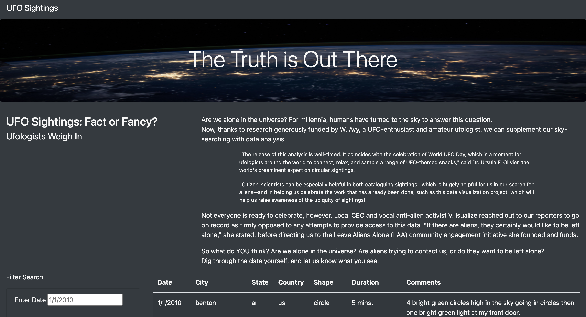
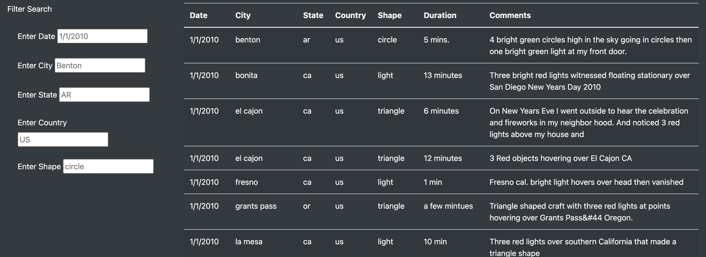
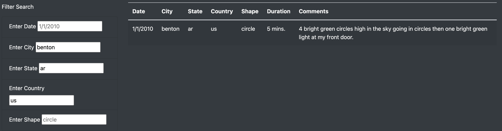

# UFOs
UFO Sightings with JavaScript
## Overview
  This project Dana would like us to continue to use JavaScript to help better her webpage. She wants us to make it so we can search by different filters. Those filter types are city, state, country, and shape of UFO. We are going to do this by making the webpage more dynamic.
## Results
Welcome to UFO sightings!

How you filter is at the bottom of the page with city, state, country, and shape of UFO.

You type the info you would like to find and it will automaticly search for it for you. 
## Summary
### Drawback
The one downfall about how the filter is set up it is case sensetive. That means you have to put it in exactly like the person that put it in does.

### Recommendations
The first recommondation we would put in would be to be able to search by a range of date and not just one date. This would give us more helpfull results.
The second recommondation we would do is make it so it did not matter how you typed the word in it would still pull the results that you wanted to get.
